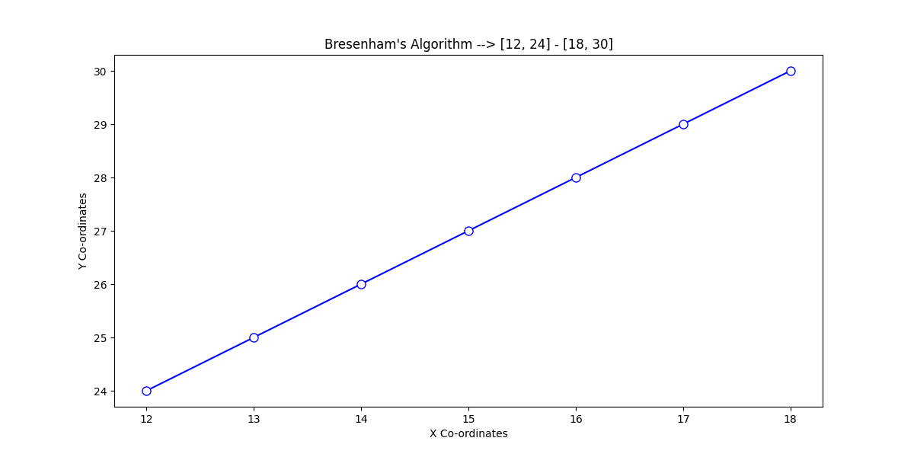
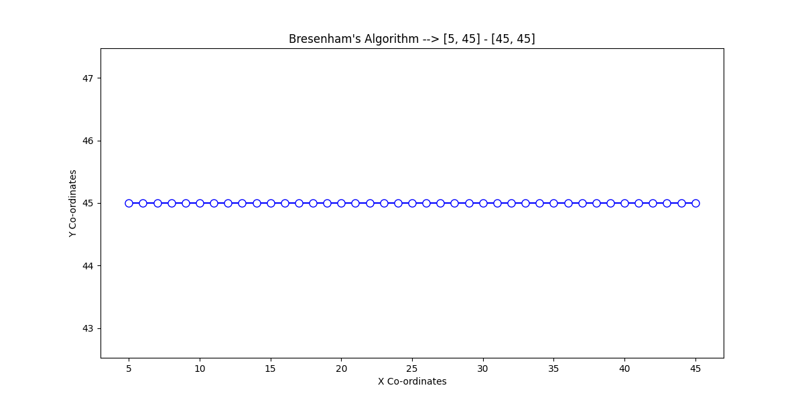
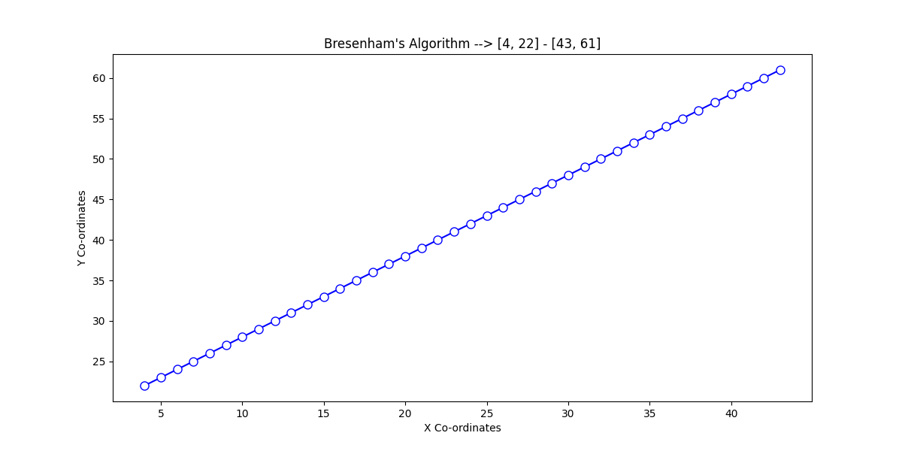

# *Bresenham's Line Drawing Algorithm*

*The Bresenham's line algorithm is an algorithm that determines which points in an `n-dimensional` raster should be plotted in order to form a close approximation to a straight line between two given points.*  
*It is an incremental scan conversion algorithm that uses only integer calculations.*  
*It is commonly used to draw lines on a computer screen, as it uses only integer addition, subtraction and bit shifting, all of which are very cheap operations in standard computer architectures.*

## *Steps*

*1. Input the Origin and End points*  
*2. Calculate the change in `x` and `y` ie. `∆y...∆x`*  
*3. Obtain the Decision Parameter `P∘`*
> *4. Test if `P∘ < 0` then the next Coordinate will be `(X+1, Y)` and `P1 = P∘ + 2∆y`.*
> *If not, `(X+1, Y+1)` and `P1 = P∘ + 2(∆y - ∆x)`.*

*5. Coordinate in 4 becomes New Origin.*
*6. Repeat using the `P1` as the new Decision Parameter.*

## *Examples*

